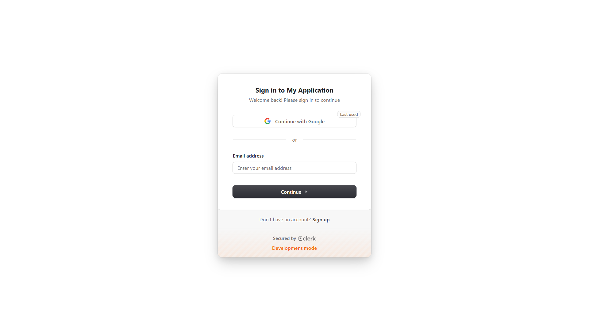

# 🇻🇳 Vietnam Tourism RAG Chatbot  

[](https://www.python.org/)
[](https://fastapi.tiangolo.com/)
[](https://nextjs.org/)
[](https://www.docker.com/)
[](https://www.mongodb.com/)
[](LICENSE)

> **Vietnam Tourism RAG Chatbot** is an AI-powered assistant that provides personalized and accurate travel recommendations for destinations across Vietnam.  
> Built with a modern **Retrieval-Augmented Generation (RAG)** architecture and deployable via **Docker Compose** with a single command.

---

## 🧠 Overview

This project demonstrates a production-ready **RAG chatbot** that combines **semantic retrieval** and **large language models (LLMs)** to deliver relevant and grounded answers about Vietnam’s destinations, cuisine, and culture.  

The system integrates:
- **FastAPI** backend for ML & RAG logic  
- **Next.js + React** frontend with authentication (Clerk)  
- **MongoDB** for chat history storage  
- **ChromaDB** or fine-tuned embedding model for retrieval  

---

## ✨ Key Features

- 🧩 **Dual RAG Modes**
  - **Fine-tuned Mode** → Uses `bkai-foundation-models/vietnamese-bi-encoder` for embedding and improved semantic retrieval.  
  - **Lightweight Mode** → Uses `text-embedding-3-small` with ChromaDB for fast and cost-efficient setup.  
- 💬 **Small Talk Classifier** — intelligently detects and handles general conversation.  
- ⚡ **Context Optimization** — dynamically trims and refines context before feeding it to the LLM.  
- 🐳 **One-Command Deployment** — full setup with Docker Compose.  
- 🖥 **Modern UI** — responsive chat interface with history, citations, and real-time streaming.  

---

## 🧩 System Architecture

```text
User Query
   ↓
Frontend (Next.js + Clerk)
   ↓
Small Talk Classifier
   ↓
Embed Query (bi-encoder / text-embedding-3-small)
   ↓
Vector Search (ChromaDB)
   ↓
Append Relevant Context
   ↓
LLM (GPT-4o-mini)
   ↓
Stream Response → Frontend UI
   ↓
Save Chat History (MongoDB)
```

---

## ⚙️ Tech Stack

| Layer | Technologies |
|:------|:--------------|
| **Frontend** | Next.js, React, Clerk |
| **Backend** | FastAPI, Python |
| **LLM** | GPT-4o-mini |
| **Embeddings** | `bkai-foundation-models/vietnamese-bi-encoder`, `text-embedding-3-small` |
| **Vector Store** | ChromaDB |
| **Database** | MongoDB |
| **Containerization** | Docker, Docker Compose |

---

## 🖥 System Requirements

| Component | Minimum Version |
|------------|-----------------|
| Python | 3.10+ |
| Node.js | 18+ |
| Docker | 20.10+ |
| Docker Compose | 2.0+ |

---

## 🔐 Environment Setup

Before running Docker, set up environment variables.  
You’ll need **two `.env` files**: one for the backend and one for the frontend.

### 📁 Backend (`backend/.env`)
```bash
OPENAI_API_KEY="YOUR_OPENAI_API_KEY"
CHROMA_OPENAI_API_KEY="YOUR_OPENAI_API_KEY"
```

### 📁 Frontend (`frontend/.env`)
```bash
DATABASE_URL=""mongodb+srv://<username>:<password>@<cluster-name>.mongodb.net<database-name>?retryWrites=true&w=majority&appName=<app-name>""
NEXT_PUBLIC_CLERK_PUBLISHABLE_KEY="YOUR_CLERK_PUBLISHABLE_KEY"
CLERK_SECRET_KEY="YOUR_CLERK_SECRET_KEY"
```

#### ⚠️ Notes:
- You need a **MongoDB Atlas** account and a created cluster + database.  
- Obtain your **OpenAI API key** or replace it with another LLM provider if needed (Gemini, Claude, etc.).  
- Clerk keys are required for authentication; you can sign up at [https://clerk.com](https://clerk.com).  

---

## 🚀 Quick Start

### 1️⃣ Clone the Repository
```bash
git clone https://github.com/Samzaq/vietnam-tourism-rag-chatbot.git
cd vietnam-tourism-rag-chatbot
```

### 2️⃣ Set Up Environment Variables
Create `.env` files as shown in the section above.

### 3️⃣ Start the System
```bash
docker-compose up --build
```

### 4️⃣ Access the App
```bash
http://localhost:3000
```

---

## 🌐 Demo

| Login Page | Chat Interface |
|-------------|----------------|
|  |  |

> 🎬 See the chatbot in action:

**Vietnam Tourism RAG Chatbot Demo:** 


---

## 📁 Project Structure

```text
├── frontend/          # Next.js + React UI
├── backend/           # FastAPI backend (RAG pipeline)
├── docs/              # Screenshots and demo GIFs
├── docker-compose.yml # One-command deployment
└── README.md
```

---

## 🧠 How It Works

1. The user sends a query through the web UI.  
2. The backend determines if it's small talk or a factual question.  
3. The query is embedded and searched within the vector database.  
4. Relevant context is appended to the LLM prompt.  
5. GPT-4o-mini generates a response grounded in retrieved data.  
6. The frontend displays and stores the conversation in MongoDB.  

---

## 🧰 Troubleshooting

| Issue | Possible Cause | Solution |
|:------|:----------------|:----------|
| Docker build fails | Missing env files | Ensure `.env` files exist in `backend/` and `frontend/`. |
| LLM not responding | Invalid API key | Verify your `OPENAI_API_KEY` or LLM provider key. |
| Frontend not loading | Port conflict | Ensure port 3000 is not in use or update in `docker-compose.yml`. |

---

## 📈 Highlights

- 🧩 Demonstrates **end-to-end RAG architecture** with full-stack integration.  
- 🧰 **Containerized deployment** for portability and scalability.  
- 💡 Can be extended to other domains beyond tourism.  
- 🧩 Have English–Vietnamese bilingual support.
- 🔍 Reranking model for enhanced retrieval accuracy.  